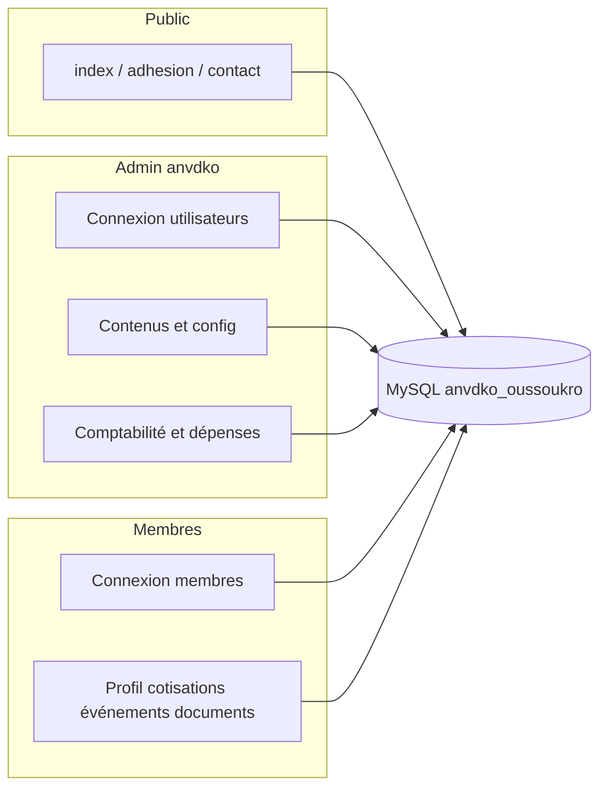

# Documentation du projet ANVDKO

Ce document décrit l’organisation du dépôt, les zones applicatives (site public, espace administration, espace membre), les principales bases de données et tables observées dans le code, ainsi qu’un plan fonctionnel général. Il est issu de l’analyse du code source au moment de sa rédaction.

---

## 1. Vue d’ensemble

**ANVDKO** est une application web PHP orientée association, déployée typiquement sous **WAMP** (Windows, Apache, MySQL, PHP). Elle couvre :

- une **vitrine** et des formulaires publics (adhésion, contact) ;
- un **back-office** (`anvdko/`) pour les utilisateurs « administration » (comptes dans `utilisateurs`) ;
- un **espace membre** (`membres/`) pour les personnes enregistrées dans `membres`.

Le thème administration repose sur des assets de type **Phoenix** (Bootstrap, Feather icons, etc.). L’espace membre et le site public utilisent Bootstrap et des gabarits HTML dédiés.

---

## 2. Arborescence logique

| Zone | Dossier / fichiers racine | Rôle |
|------|---------------------------|------|
| Site public | `index.php`, `adhesion.php`, `projets.php`, `forms/`, `assets/`, `includes/` | Présentation, navigation publique, formulaires |
| Administration | `anvdko/` | Connexion admin, tableau de bord, contenus, comptabilité, membres, configuration |
| Espace membre | `membres/` | Connexion membre, profil, cotisations, événements, documents |
| Partagé | `include/php/` (connexion BDD, fonctions), `fichiers/` (uploads, logos) | Utilitaires et médias communs |

Fichiers de connexion notables :

- `include/php/connexion_bdd.php` — connexion **MySQLi** vers la base **`anvdko_oussoukro`** (utilisée par la majorité des pages métier).
- `includes/php/bdd.php` — variante avec **`anvdko`** et objet `mysqli` (présence dans le projet ; usage selon les modules).

---

## 3. Technologies et prérequis

- **Langage** : PHP (sessions, MySQLi, parfois requêtes préparées côté documents).
- **Base de données** : MySQL / MariaDB.
- **Front** : HTML, CSS (Bootstrap 5), JavaScript (Ajax pour connexions, formulaires, APIs dépenses).
- **Serveur** : Apache (ex. WAMP), avec réécriture éventuelle selon votre configuration.

**Fuseau horaire** : `Africa/Abidjan` est défini dans `connexion_bdd.php`.

---

## 4. Modèle de données (tables repérées dans le code)

Le schéma SQL complet n’est pas versionné dans le dépôt (sauf script partiel pour les dépenses). La liste ci-dessous regroupe les **noms de tables** réellement utilisés dans les requêtes PHP.

### 4.1 Association et utilisateurs

| Table | Usage typique |
|-------|----------------|
| `configurations` | Identité de l’association (nom/sigle, contacts, logo, etc.) — liée aux utilisateurs et au contexte `$_SESSION['configuration']`. |
| `utilisateurs` | Comptes d’administration (pseudo, téléphone, email, mot de passe, statut, rôle `secretaire`, lien `id_configuration`). |
| `membres` | Adhérents (identité, genre, cotisation, `membre_bureau`, `qr_url`, `num_adhesion`, dates, statut, etc.). |

### 4.2 Cotisations et paiements

| Table | Usage typique |
|-------|----------------|
| `paiements` | Paiements mensuels par membre et par mois (`mois_payer`, montants, statut « Payé », « Moitié payé », etc.). |
| `config_cotisations_exceptionnelles` | Motifs d’exception (montants standard, par genre, bureau, périodes). |
| `exceptionnels_pay` | Suivi des paiements exceptionnels par membre et par motif. |

### 4.3 Contenus éditoriaux

| Table | Usage typique |
|-------|----------------|
| `cat_actualites` | Catégories pour actualités (et réutilisées pour catégorisation agenda / ADCI TV dans certains écrans). |
| `actualites` | Articles d’actualités. |
| `agenda` | Entrées d’agenda. |
| `event_cat` | Catégories d’événements. |
| `evenements` | Événements (dates, contenu, lien catégorie). |
| `adci_tv` | Contenus type média / chaîne « ANVDKO TV » ou ADCI TV. |

### 4.4 Dons et documents

| Table | Usage typique |
|-------|----------------|
| `faire_don` | Enregistrement des dons (coordonnées donateur, montant, moyen de paiement). |
| `documents` | Médiathèque membres (métadonnées fichier, catégorie, visibilité, taille, statut). |

### 4.5 Dépenses (module dédié + script SQL)

Script : `anvdko/sql/create_expense_tables.sql`.

| Table | Rôle |
|-------|------|
| `depenses_anvdko` | Dépense (titre, catégorie, description, dates, `id_user`). |
| `depense_montants` | Un ou plusieurs paiements partiels par dépense. |
| `depense_commentaires` | Fil de commentaires sur une dépense. |

### 4.6 Inscriptions aux événements (membres)

| Table | Rôle |
|-------|------|
| `inscription_evenement` | Inscription d’un membre à un événement (nombre de personnes, commentaire, newsletter). |

### 4.7 Modules « commandes / stock » (legacy ou multi-usage)

Présents dans `anvdko/includes/php/ajax/details_commande.php` et reçus : `commandes`, `produits_commande`, `produits`, `clients`, `livreurs`, `fermes`, `factures`, `journal_caisse`, `cat_produits`, `select_cats_produit`, `cat_nestable`. Ces éléments suggèrent un **sous-système de gestion de commandes** (possiblement réutilisé ou en parallèle avec la gestion associative).

### 4.8 Point d’attention

Le fichier `anvdko/ajax/get_expense_details.php` référence une table `users` dans un `JOIN` — le reste du projet utilise surtout `utilisateurs`. À vérifier en base (homonyme, vue, ou correction à prévoir).

---

## 5. Espace administration (`anvdko/`)

**Authentification** : `anvdko/index.php` (formulaire), traitement Ajax dans `anvdko/ajax.php` (chargement session `utilisateur` + `configuration`).

**Contrôle d’accès** : `anvdko/includes/php/connexion_acces_page.php` vérifie que `$_SESSION['utilisateur']['statut'] == 'actif'`.

### 5.1 Menu et profils

Le fichier `anvdko/includes/php/menu.php` distingue notamment :

- **`secretaire === "Oui"`** : menu réduit — accès notamment à **Gestion membres** (`adherents.php`) et **Gestion dons** (`gestions_dons.php`).
- **`secretaire === "Non"`** : menu orienté contenu (catégories, actualités, agenda, événements, ADCI TV, configuration, utilisateurs) sans le bloc comptabilité étendu visible dans la branche suivante.
- **Autres cas** (sinon) : menu large avec **Comptabilité** (paiements mensuels, récaps, exceptionnels), **Dépenses Anvdko**, agenda, événements, TV, membres, cartes membres, configuration, utilisateurs.

### 5.2 Pages principales et rôle concret

| Fichier | Fonction |
|---------|----------|
| `accueil.php` | Tableau de bord avec agrégations sur `paiements` (mois en cours, 3 / 6 mois, année) et indicateurs financiers pour l’admin. |
| `configuration.php` | Mise à jour de la fiche `configurations` (contacts, email, localisation, logo). |
| `utilisateurs.php` | CRUD des lignes `utilisateurs` (dont indicateur secrétaire). |
| `adherents.php` | Liste / accès vers la gestion des **membres** (liaison avec `adherent_details.php`). |
| `adherent_details.php` | Création / modification d’un membre (`membres`), y compris champ **membre du bureau** (voir `README_MEMBRE_BUREAU.md`). |
| `actualites_cats.php` | CRUD `cat_actualites`. |
| `actualites.php` + `actualite_details.php` | Liste et édition des `actualites`. |
| `agenda.php` + `agenda_details.php` | Liste et édition des entrées `agenda`. |
| `event_cats.php` | CRUD `event_cat`. |
| `evenements.php` + `evenements_detail.php` | Liste, publication / suppression, détail des `evenements`. |
| `adci_tv.php` + `adci_tv_details.php` | Gestion des contenus `adci_tv`. |
| `gestions_dons.php` | Saisie et liste des dons (`faire_don`), filtrage, suppression. |
| `pay_mensuels.php` | Interface de paiement des cotisations mensuelles. |
| `pay_mensuels_recap.php`, `recap_pay_mensuel.php` | Récapitulatifs des paiements mensuels. |
| `exceptionnels_pay.php` | Paiements de cotisations exceptionnelles (montants selon genre / bureau via `config_cotisations_exceptionnelles` et `membres`). |
| `create_exceptionnel.php` | Création d’une configuration de cotisation exceptionnelle. |
| `exceptionnels_pay_recap.php` | Récapitulatif des exceptionnels. |
| `plusieursPaiements.php` | Paiement groupé de plusieurs membres. |
| `paiements_membre.php` | Détail paiements pour un membre sélectionné côté admin. |
| `paiement_ajax.php`, `paiementsGroupe_ajax.php`, `process_multiple_payments.php`, `get_montant.php`, `get_membre_info.php`, `get_multiple_membres_info.php` | Endpoints et logiques Ajax pour encaissements et infos membres. |
| `stock.php`, `stocks.php` | Exploitation des données de paiements / membres pour des vues de type « stock » ou synthèse (à rapprocher du contexte métier exact sur l’instance). |
| `cartesAdherents.php`, `voir_cartes.php`, `generer_cartes_pdf.php`, `badge.php`, `badge_template.php` | Génération / visualisation de **cartes** et badges adhérents (QR, mise en page). |
| `depenses_anvdko.php`, `depense_detail.php` | Liste et fiche des dépenses association. |
| `ajax/depenses_api.php`, `ajax/commentaires_api.php`, `ajax/get_expense_details.php` | API JSON pour CRUD dépenses, montants, commentaires. |
| `ajax_autre.php` | Recherches / mises à jour transverses (actualités, agenda, événements, TV, membres, dons, statuts). |
| `mon_compte.php`, `deconnexion.php` | Compte admin courant et sortie de session. |
| `upload.php` | Téléversement de fichiers (usage selon modules). |
| `produits.php` | Gestion de produits et catégories (tables `produits`, `cat_produits`, etc.) — voir module commandes. |
| `includes/php/ajax/details_commande.php`, `includes/php/recus/recu1.php`, `recu2.php` | Détail commande, facturation, reçus. |

---

## 6. Espace membre (`membres/`)

**Authentification** : `membres/index.php` (interface), `membres/connexion.php` (Ajax : vérifie `membres` actifs par téléphone + mot de passe).

**Contrôle d’accès** : `membres/includes/php/connexion_acces_page.php` — redirige si `$_SESSION['membre']['statut'] != 'actif'`.

### 6.1 Pages et rôle concret

| Fichier | Fonction |
|---------|----------|
| `accueil.php` | Accueil membre, possibilité de **modifier le profil** (`UPDATE membres`), photo, coordonnées. |
| `profil.php` | Profil (selon implémentation locale). |
| `voir_cotisation.php` | Consultation de l’état des **paiements mensuels** du membre connecté. |
| `recap_pay_mensuels.php`, `recap_pay_exeptionnels.php` | Récapitulatifs côté adhérent. |
| `evenements.php` | Liste / interaction avec les événements (inscription via scripts associés). |
| `historique-evenements.php` | Liste des événements **passés** (`evenements` avec `date_debut < NOW()`), recherche côté client. |
| `traitement_inscription.php` | API JSON : inscriptions `inscription_evenement` (création, modification, suppression, lecture). |
| `membres.php` | Annuaire ou liste de membres (requêtes sur `membres`). |
| `documents.php`, `upload_document.php` | Bibliothèque de documents et upload (`documents`). |
| `stock.php` | Vue « stock » ou ressources pour le membre (alignée sur la logique métier du fichier). |
| `badge.php`, `voir_badge.php`, `badge1.php` | Affichage badge / QR pour le membre connecté. |
| `password_forget.php` | Récupération ou aide mot de passe (selon implémentation). |
| `deconnexion.php` | Fin de session membre. |
| `ajax.php` | Actions Ajax diverses côté membre. |

---

## 7. Site public (racine et `forms/`)

| Fichier | Fonction |
|---------|----------|
| `index.php` | **Page d’accueil** du site ANVDKO (présentation, liens). |
| `adhesion.php` | Formulaire d’**adhésion** en ligne (soumission gérée côté JS / backend selon votre flux). |
| `projets.php` | Page projets ou contenus associés. |
| `forms/contact.php`, `forms/test_local.php` | Formulaire de contact et éventuel test local. |
| `ajax.php` (racine) | Traitement Ajax pour le site public si utilisé. |

Les assets partagés (`assets/`, `includes/php/header.php`, `footer.php`, etc.) structurent la mise en page commune.

---

## 8. Fichiers inclus et utilitaires

- `include/php/fonctions.php` — fonctions transverses (chiffrement de chaînes pour IDs, URLs fichiers, rechargements de page, etc.).
- `anvdko/includes/php/header.php`, `footer.php`, `includes-css.php`, `includes-js.php` — gabarit admin.
- `membres/includes/php/header.php`, `footer.php`, `include-css.php`, `include-js.php` — gabarit membre.

---

## 9. Flux fonctionnels (résumé)

1. **Adhésion / membre** : un visiteur peut adhérer (`adhesion.php`) ; les données aboutissent dans `membres` (selon le traitement branché sur votre formulaire). Le membre se connecte via `membres/`.
2. **Administration** : un utilisateur `utilisateurs` se connecte via `anvdko/` ; il administre contenus, membres, dons, cotisations et éventuellement commandes/stock.
3. **Cotisations** : les paiements mensuels alimentent `paiements` ; les exceptionnels utilisent `config_cotisations_exceptionnelles` + `exceptionnels_pay`.
4. **Communication** : actualités, agenda, événements et médias TV sont stockés dans les tables homonymes et affichés côté public ou membre selon les pages exposées.
5. **Dépenses** : module isolé avec API Ajax et tables `depenses_*`.

---

## 10. Sécurité et bonnes pratiques (constat code)

À traiter progressivement en production :

- Requêtes construites par **concaténation** de chaînes avec données utilisateur — risque d’**injection SQL** ; privilégier **requêtes préparées** partout (déjà amorcé sur `upload_document.php`).
- Authentification par **mots de passe en clair** en base (constat sur les requêtes de login) — prévoir hachage (**password_hash** / **password_verify**) et politique de mots de passe.
- Cohérence des noms de bases (`anvdko` vs `anvdko_oussoukro`) et de la table `users` vs `utilisateurs`.

---

## 11. Documentation interne existante

- `anvdko/README_MEMBRE_BUREAU.md` — cotisations exceptionnelles différenciées (**membre du bureau**, **genre**), scripts SQL suggérés (`add_membre_bureau_column.sql`, `add_montant_femme_column.sql` — à localiser ou recréer sur l’environnement).
- `anvdko/sql/create_expense_tables.sql` — création des tables du module **dépenses**.

---

## 12. Plan général du projet (vision produit)

| Axes | Description |
|------|-------------|
| **Identité & paramètres** | Configuration de l’association, utilisateurs back-office, droits secrétaire vs complet. |
| **Adhérents** | Membres, cartes, badges QR, annuaire, profil en ligne. |
| **Finances internes** | Cotisations mensuelles et exceptionnelles, récapitulatifs, dons, module dépenses. |
| **Vie associative** | Actualités, agenda, événements, inscriptions membres, historique. |
| **Médias** | Chaîne / contenus ADCI TV (ANVDKO TV). |
| **Documents** | Dépôt et classement de fichiers pour les membres. |
| **Extensions** | Module commandes / produits / factures (code présent, à valider par rapport au périmètre métier réel). |

---

## 13. Maintenance de ce document

Ce fichier est une **photographie** du code dans le dépôt. Après toute évolution majeure (nouvelles tables, nouvelles pages, changement de base), mettre à jour les sections **4**, **5**, **6** et **12** en conséquence.

---

*Document généré pour faciliter l’onboarding et la vision globale du projet ANVDKO.*
